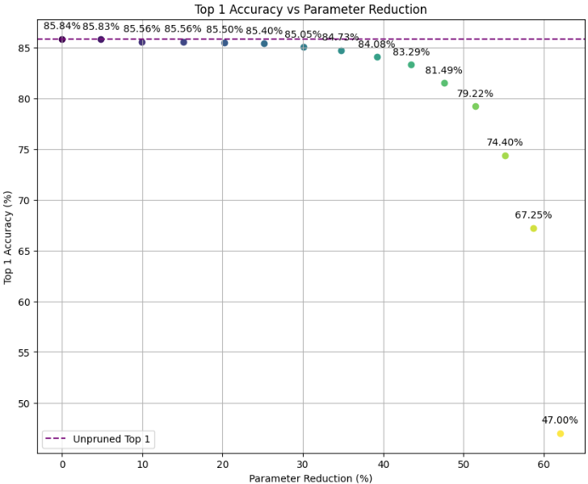
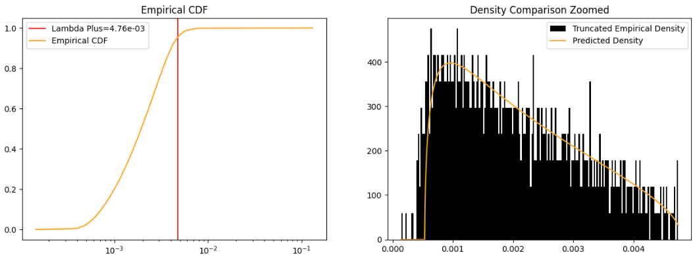

# Efficient Pruning of Vision Transformers using Random Matrix Theory


This repository contains the implementation of the paper Efficient Pruning of Vision Transformers using Random Matrix Theory. The code provides tools to prune Vision Transformers (ViTs) using insights from Random Matrix Theory (RMT) for significant parameter reduction with minimal accuracy loss.




*Figure: Accuracy vs. Parameters Kept for ViT-Base. The model achieves substantial pruning with negligible accuracy loss.*


# Highlights

This project introduces an RMT-based pruning framework that efficiently reduces the size of Vision Transformers by identifying and removing noise in weight matrices, guided by the Marchenko-Pastur (MP) distribution. Theoretical and experimental results demonstrate:
- Parameter Reduction: Up to 50% pruning in ViTs with <1% accuracy loss.
- Theoretical Insights: Proves that training with regularization naturally reduces noise in weight matrices, and removing this noise improves the loss without affecting accuracy.
- **Practical Gains**:
  - ViT-Base: 30% parameter reduction with 0.6% top-1 accuracy loss after fine-tuning.
  - ViT-Large: 50% parameter reduction with 1.4% top-1 accuracy loss after fine-tuning.


*Figure: Singular Value Distribution for ViT-Base. The distribution aligns well with the predictions from Random Matrix Theory, validating our approach.*


# Repository Structure
- [src/](src/): Source code directory.
  - [src/validation.py](src/validation.py): Evaluation functions for the model.
  - [src/utils.py](src/utils.py): General utilities used across the project.
  - [src/training.py](src/training.py): Training and fine-tuning routines.
  - [src/SplittableLayers.py](src/SplittableLayers.py): Custom layers supporting pruning.
  - [src/RMT.py](src/RMT.py): Core Random Matrix Theory implementations.
  - [src/pruning.py](src/pruning.py): Functions for pruning the model.
- [prune.py](prune.py): Main script for pruning and fine-tuning.
- [fine_tune.py](fine_tune.py): Script for fine-tuning a pruned model.

# Installation

Install dependencies with:
```bash
pip install -r requirements.txt
```

# Usage
In the paper, we demonstrate the effectiveness of RMT-based pruning on Vision Transformers. The code provides tools to prune and fine-tune ViTs using RMT insights. If you want to reproduce our findings and the figure above, you may run the pruning script, followed by fine-tuning. This will implement Algorithm 3 from the paper.


## Prune a Vision Transformer with:
```bash
python prune.py --device <device> --save_path <path_to_save_model> --plot <True/False>
```

**Arguments**:
- --device: Device for computation (cuda:0 by default).
- --save_path: Path to save the pruned model.
- --plot: Whether to plot results (True by default).


## Fine-tune a pre-trained ViT model with:
```bash
python fine_tune.py --device <device> --weights_path <path_to_weights> --save_path <path_to_save_model>
```

Arguments
- --device: Device for computation (cuda:0 by default).
- --weights_path: Path to pre-trained model weights.
- --save_path: Path to save the fine-tuned model.


# Theoretical Contributions

The paper establishes a rigorous foundation for RMT-based pruning. Key results include:
- Theorem: Proves that regularization during training reduces randomness in weight matrices, aligning them more closely with deterministic structures.
- Pruning Effectiveness: Demonstrates that removing noise (as identified by MP distribution) reduces the loss without compromising accuracy.

These insights provide a solid theoretical justification for using RMT to guide pruning in modern deep learning architectures.

# Citation

If you use this code, please cite:

```bibtex
@article{rmt_pruning_vit,
  title={Efficient Pruning of Vision Transformers using Random Matrix Theory},
  author={Authors},
  journal={Journal},
  year={2022}
}
```